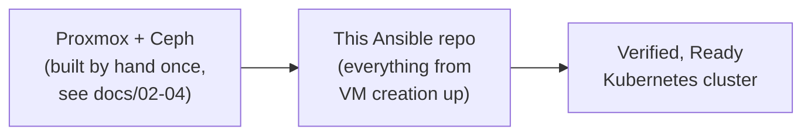

# Ansible — Proxmox K8s Platform

Turns a running Proxmox/Ceph/Rancher foundation into a fully deployed, verified Kubernetes cluster — idempotently, staged into 12 numbered playbooks that can run as a whole pipeline or individually.

> This is the automation layer. For *why* it's built this way, see the [`../docs/`](../docs) — this README covers *how to run it*.

## What this deliberately does not automate

Proxmox cluster formation, physical networking, and Ceph itself are **not** driven by this Ansible repo — they're hardware-adjacent, and a misconfiguration there risks the whole lab's storage or network, not just one cluster. This automation picks up *after* that foundation exists (see [`../docs/02-proxmox-foundation.md`](../docs/02-proxmox-foundation.md) through [`04-ceph-storage.md`](../docs/04-ceph-storage.md)) and owns everything from VM creation upward.



## Prerequisites

- Ansible control node with network access to the Proxmox API and the VLAN the VMs live on
- `community.general` collection (`ansible-galaxy collection install community.general`)
- A Proxmox API token (Datacenter → Permissions → API Tokens)
- A Rancher API token, if joining an existing Rancher instance (`use_existing` mode)

## Configuring a run

```bash
cp deploy-config.yml.example deploy-config.yml
# edit deploy-config.yml — cluster name, mode, node sizing, which Rancher/hub instance to use

cp inventories/production/group_vars/all/vault.yml.example \
   inventories/production/group_vars/all/vault.yml
# fill in real values, then:
ansible-vault encrypt inventories/production/group_vars/all/vault.yml
```

`deploy-config.yml` is the single file that changes between runs — cluster topology, mode (`new_cluster` vs `add_node`), and which pre-registered Rancher/hub instance to target. `vault.yml` holds everything that's actually secret (API tokens, passwords) and is never committed unencrypted.

## Running

```bash
# Full pipeline, all 12 stages:
ansible-playbook site.yml -e @deploy-config.yml --ask-vault-pass

# One stage only — useful for re-testing a fix without rebuilding from scratch:
ansible-playbook site.yml -e @deploy-config.yml --ask-vault-pass -e '{"run_only":[7,12]}'

# Syntax check before a real run:
ansible-playbook site.yml -e @deploy-config.yml --ask-vault-pass --syntax-check
```

> ⚠️ **`run_only` isolates *which plays run*, not what state they can assume.** A play that silently depended on an earlier play having run first — a fact gathered, a variable set — can pass every time the full pipeline runs and fail the moment it's run in isolation. Several real bugs in this repo were only found this way; see [`TROUBLESHOOTING.md`](TROUBLESHOOTING.md).

## The pipeline, stage by stage

| Stage | Does |
|---|---|
| 01 | Clone VMs from the template, size RAM/CPU by live node capacity, resize disk |
| 02 / 02b | Discover DHCP-assigned IPs via the guest agent; optionally pin one as static |
| 03 | Configure the storage-VLAN NIC on each VM |
| 04 | OS prep — package updates, disable conflicting software, extend disk, disable swap |
| 05 | Install Rancher itself (only when `rancher_mode: install_new`) |
| 06 | Place CNI/CoreDNS manifests **before** any node joins — see [`../docs/05-rancher-rke2-deployment.md`](../docs/05-rancher-rke2-deployment.md) for why the order matters |
| 07 | Call the Rancher API to register the cluster, then join every node |
| 08 | Ceph CSI-RBD — dedicated pool, StorageClass, a real PVC test |
| 09 | Monitoring agent → the observability hub |
| 10 | Logging agent → the observability hub |
| 11 | *(placeholder — GitLab/Harbor CI-CD, not yet implemented)* |
| 12 | End-to-end verification — every check backed by real command output, not assumed state |

## Tearing a cluster down

```bash
ansible-playbook cleanup.yml -e @deploy-config.yml -e "confirm_destroy=yes"
```
Destroys the VMs, removes the cluster from Rancher, cleans local run-state files. Deliberately requires an explicit `confirm_destroy=yes` — there's no default-yes path to destroying infrastructure.

## Design principles this repo tries to hold to

- **Idempotent.** Re-running against an already-provisioned cluster should converge, not duplicate or error.
- **Verify with real output, not assumed success.** `STATUS: deployed` from Helm, or a task reporting `ok`, doesn't mean the thing it deployed is actually healthy — every stage that matters ends with a check against real state (`kubectl get pods`, an HTTP probe, an actual PVC bind).
- **Manifest-first for anything CNI-related.** Configuration that affects cluster networking goes into place *before* the relevant service starts for the first time — patching after the fact is how several of the bugs in [`TROUBLESHOOTING.md`](TROUBLESHOOTING.md) happened.

See [`TROUBLESHOOTING.md`](TROUBLESHOOTING.md) for the real bugs found building this — race conditions, a PATH resolution bug that only appears when running an isolated stage, and the debugging path for each.
