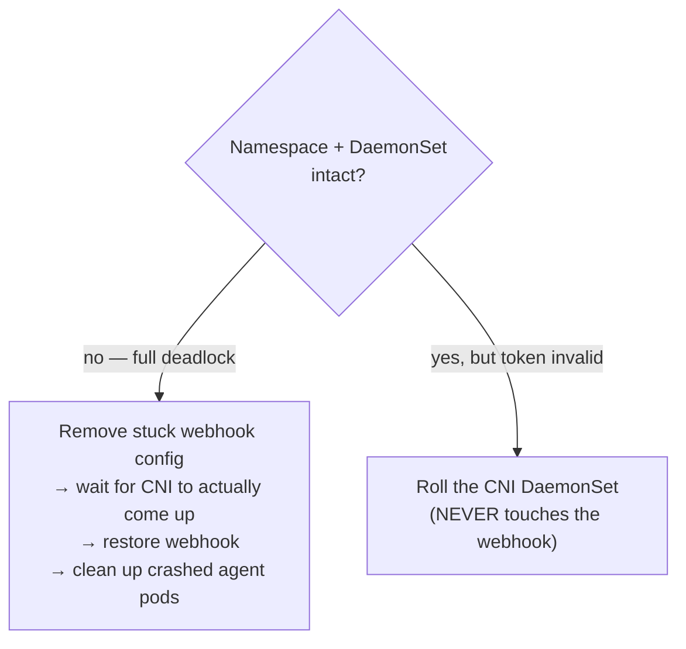

# Ansible Troubleshooting

Real bugs found building and running this automation, kept with their debugging path — not just the fix. Several `docs/troubleshooting/` pages reference back to this file for the Ansible-specific half of a bug that started as an infrastructure problem.

## The self-healing watchdog — a boot-time deadlock that needed automation, not a patch

The infrastructure story (what the deadlock actually is, and why a one-time `kubectl patch` can never close it) is in [`../docs/troubleshooting/observability-hub.md`](../docs/troubleshooting/observability-hub.md#bug-8). This is the implementation half: a `systemd` timer, installed by [`playbooks/07-join-cluster.yml`](playbooks/07-join-cluster.yml) on every cluster's control-plane node, that detects the deadlock and repairs it without a human involved.

**Design — two separate repair paths, deliberately not merged:**

Keeping these paths separate matters: the full-deadlock repair is invasive (it touches a Rancher-managed webhook config) and should only ever run when the deadlock is actually confirmed, not as a first guess for a lighter symptom. A safety net catches the case where Rancher re-applies its own webhook config faster than expected — the watchdog re-checks and backs off rather than fighting Rancher for ownership of the same resource — and a rate limit (3 repairs/hour) stops the watchdog from masking a *different*, unrelated problem by repairing in a loop forever.

**A defect in the first version, caught by the watchdog's own test:** version 1 waited for `rollout status` on the CNI DaemonSet with a fixed timeout, then checked the result once. On this hub, a legitimate rollout sometimes took longer than that timeout — so a repair that was already succeeding on its own got misread as failed, and the watchdog escalated to the invasive full-repair path for a problem that would have resolved itself in another few seconds.

**The fix, and the general lesson:** poll for the actual condition being waited on, don't trust a fixed timeout to mean failure. And: **an escalation path should only ever escalate within the same category of problem** — a slow-but-succeeding repair and a genuinely stuck one look identical to a timer, but they need opposite responses.

## `run_only` isolation exposes bugs the full pipeline was hiding

Two separate, real bugs — both invisible when the whole pipeline ran start to finish, both surfacing the first time a play was tested in isolation.

### A loop label that assumed a fact existed

A play used `{{ some_fact[idx] }}` as its `loop_control.label` — purely cosmetic, just what gets printed next to `skipping:` in the output. That fact was set by an earlier task **in the same play**. When the whole play got skipped (via `when: stage_N | bool` evaluating false, because `run_only` didn't include that stage), Ansible still had to render the label to print the skip message — and the fact it needed had never been set, because the task that would have set it was *also* skipped.

**Fix:** the label was changed to reference only `item.*` fields, which always exist regardless of whether the task actually runs. **General rule this repo adopted:** a `loop_control.label` must never depend on state set earlier in the same play — it has to render correctly even when the whole play is a no-op.

### A `PATH` that only worked by accident of execution order

Several plays set `environment.PATH` using `{{ ansible_env.PATH | default(...) }}` — but those plays also had `gather_facts: false`. `ansible_env` is only populated by a fact-gathering task, and none of these plays gathered facts themselves. Running the *full* pipeline worked anyway, because an *earlier, unrelated* play in the same `site.yml` run happened to gather facts first — and Ansible caches gathered facts **per host, for the entire run**, not per play. Any later play, even with `gather_facts: false`, could still read facts that a completely different play had already fetched.

The moment `run_only` was used to run one of these plays in isolation, no play in that run ever gathered facts — `ansible_env` came back empty, the `default(...)` fallback kicked in, and the fallback PATH was missing `/usr/local/bin`, exactly where `helm` had been installed. Every `helm` command in that play failed with a plain "command not found," in a location where facts and PATH looked, at a glance, completely unrelated to the actual cause.

**Fix:** stopped depending on `ansible_env` entirely — hardcoded the standard PATH order (`/usr/local/sbin:/usr/local/bin:/usr/sbin:/usr/bin:/sbin:/bin`) instead. This bug existed in **7 separate locations across 5 files**, all copy-pasted from the same original pattern — fixing the one that surfaced first wasn't enough; every occurrence had to be found and fixed the same way, or the very next isolated `run_only` on a *different* stage would hit the identical bug again.

**The lesson that generalizes:** Ansible's per-run fact cache means a play with `gather_facts: false` is not actually self-contained — it may be silently relying on a completely different play having run earlier in the same invocation. `run_only` (or any partial run) is what proves whether a play's assumptions are real or just accidentally-true.

## Two independent processes fighting over the same package manager lock

A pattern that recurred three separate times in this lab, in three different disguises, before it was recognized as one pattern:

1. Proxmox's own post-clone auto-upgrade hook running concurrently with Ansible's own `apt` tasks.
2. A leftover snap package's crash-looping service holding a package-manager transaction open, blocking a `snap remove` from ever succeeding.
3. Ubuntu's `unattended-upgrades`, triggered automatically on a freshly-booted VM, holding the `dpkg` lock past the timeout Ansible's `apt` task was configured to wait for.

Each time, the fix that actually stuck wasn't "wait longer" — the timeout in case #3 was already generous and still wasn't always enough. It was **making sure only one thing is ever allowed to touch the package manager**: disabling Proxmox's competing auto-upgrade at VM-creation time, stopping the crash-looping service before trying to remove its package, and — for `unattended-upgrades` — waiting for whatever's currently running to finish on its own (never killing a package-manager operation mid-write, which risks leaving `dpkg` in a half-updated state), then disabling the timer that would trigger it again on future runs of the same playbook against the same VM.

**Why this took three separate incidents to generalize:** each one was fixed as a one-off at the time, with only the specific culprit identified and disabled — not "what else could be independently touching this same resource." The pattern was only named as a pattern after the third occurrence.

## `Retry_Limit False` doesn't mean "will eventually succeed"

Several agents in this stack (log/metric shippers, particularly) are configured with unlimited retries, on purpose — losing data because a destination was briefly unreachable is worse than a backlog that catches up later. But unlimited retries only recovers from *transient* failures. Where a bug lived in a single long-running process's own connection state (see the "wedged pod" bug in [`../docs/troubleshooting/observability-hub.md`](../docs/troubleshooting/observability-hub.md)), no amount of retrying from *inside that same broken process* ever fixed it — only a restart did. Ansible tasks that wait for an agent to become "Ready" check the container's own health signal, which stayed green the entire time; nothing in the automation itself would have caught this without checking the agent's actual delivery metrics, not just its liveness.
