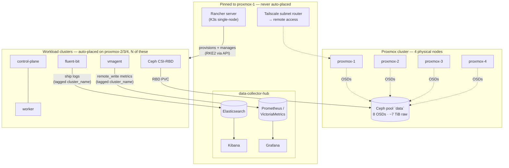

# Architecture Overview

> A more detailed isometric diagram of this system is in progress — this page's Mermaid diagram is the accurate, always-up-to-date reference in the meantime.

## The system in one paragraph

Four physical servers run Proxmox VE as a cluster, pooling their disks into one shared Ceph pool. On top of that, two roles are pinned to a single node and never moved: a **Rancher server** (the control plane that creates and manages every Kubernetes cluster) and a **data-collector hub** (the one place every cluster's logs and metrics end up). Everything else — the actual Kubernetes clusters doing work — is created by Rancher on demand, spread across the remaining nodes, and treated as disposable: destroy one, recreate it, and no history is lost, because it never held any.

## Diagram

| Arrow | Meaning |
|---|---|
| `OSDs` (dotted) | every node's local disk contributes to one shared Ceph pool — no node owns "its own" storage |
| `provisions + manages` | Rancher talks to each workload cluster's API; workload clusters never talk to each other |
| `RBD PVC` | any pod needing persistent storage gets it from Ceph, not local disk |
| `ship logs` / `remote_write metrics` | one-way, always outbound from the workload cluster — the hub is never queried by the cluster it's watching |
| `cluster_name` tag | how the hub tells apart data from N different clusters inside one shared Elasticsearch/Prometheus |

## Why it's shaped this way

**Rancher and the hub are pinned, not auto-placed.**
Every other design in this repo tries to avoid single points of failure — this is the one deliberate exception. Losing `proxmox-1` loses the control plane for *every* workload cluster and *all* observability history at once.

> ⚠️ **Known, accepted trade-off, not an oversight.** Fixing it (spreading Rancher/hub across nodes, or adding HA) was evaluated and deprioritized — see [`troubleshooting/`](troubleshooting) for what actually breaks when this node has problems, and why the fix stayed out of scope for a homelab of this size.

**Workload clusters are disposable by design.**
No cluster stores its own telemetry, so a destroy-and-recreate cycle — which happens often, both for testing and for cleaning up after a bad experiment — never loses monitoring history. The rebuild is fully automated: see [`ansible/README.md`](../ansible/README.md).

**Three VLANs, three purposes.**
Management traffic, VM/application traffic, and Ceph replication traffic never share a broadcast domain. A noisy neighbor on one can't saturate another. Full design in [`03-networking-vlan-design.md`](03-networking-vlan-design.md).

**Nothing is stored where it's produced.**
Logs and metrics leave the workload cluster the moment they're generated. This means a cluster can be torn down mid-incident without losing the evidence of what happened — the hub already has it.

## Reading the rest of the docs

Each doc under `docs/` documents one layer, in the order you'd build it:

1. [Proxmox foundation](02-proxmox-foundation.md) — the physical layer
2. [Networking & VLAN design](03-networking-vlan-design.md)
3. [Ceph storage](04-ceph-storage.md)
4. [Rancher + RKE2 deployment](05-rancher-rke2-deployment.md)
5. [Cluster operations](06-cluster-operations.md)
6. [RBAC & security](07-rbac-security.md)
7. [Observability hub](08-observability-hub.md)

Every bug that surfaced while building any of these layers lives in [`troubleshooting/`](troubleshooting), organized by topic rather than by date — read it when something in your own build looks like what's described here, not front-to-back.
