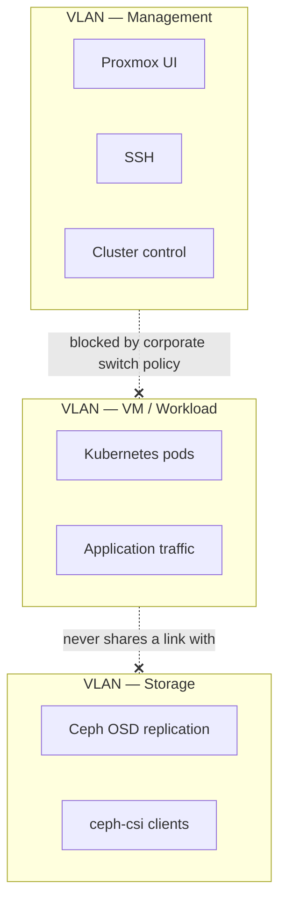
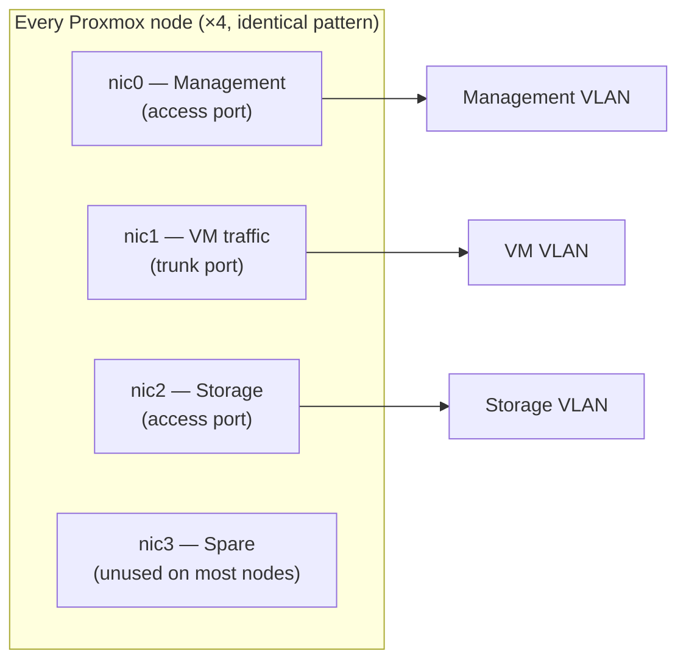

# Networking & VLAN Design

Three VLANs, three jobs, physically wired to a dedicated NIC each on every node. This page covers the physical wiring and the switch config; how each VLAN gets *used* by Ceph and by Kubernetes is covered in their own docs.

> 🔒 Real subnets, switch ports, and MAC addresses are not published in this repo — everything below uses placeholder addressing that preserves the design without exposing this network's actual layout.

## Why three separate VLANs

The starting problem was concrete, not theoretical: the existing corporate switch that this lab's management VLAN rides on **blocks TCP traffic between the VM-workload VLAN and the management VLAN** — outside this lab's control to change. Rather than route around that restriction, the lab's own switch got a third, dedicated VLAN for storage traffic instead.



| VLAN | Carries |
|---|---|
| Management | Proxmox UI, SSH, cluster control |
| VM / Workload | everything Kubernetes pods send |
| Storage | Ceph OSD replication + every Ceph client (Proxmox hosts *and* Kubernetes VMs) |

> ⚠️ **Why not just put storage traffic on the management VLAN and call it done?** Mixing storage and application traffic on one link means a noisy Kubernetes workload can starve Ceph's OSD replication of bandwidth — and Ceph replication falling behind has cluster-wide consequences (see [`04-ceph-storage.md`](04-ceph-storage.md)). Giving storage its own physical NIC and VLAN means a saturated workload VLAN literally cannot touch it.

## Physical wiring — same pattern on every node

Each of the 4 Proxmox nodes has 4 NICs, wired identically:



Real switch port numbers differ per physical node, but the NIC-to-role mapping above is identical across all four — this is a template, not a one-off. The pattern generalizes as: **management and spare ports are access ports on the management VLAN; the VM-traffic port is a trunk carrying the workload VLAN; the storage port is an access port on the storage VLAN.**

## Finding which physical port a NIC is actually on

Worth knowing before touching switch config on real hardware — guessing wrong here means cutting the wrong node's management link.

**For the management NIC (`nic0`):** it already has an IP, so generate traffic and read the switch's MAC table.
```bash
# On the Proxmox host:
ping -c 3 <gateway-ip>
```
```
# On the switch:
show mac address-table | include <nic0-mac>
```
The port shown is `nic0`'s real switch port.

**For the other NICs (no IP assigned yet):** bring the link down and watch the switch log react in real time — no need to assign a temporary IP.

1. On the switch, open a session and run `terminal monitor` — leave it open, it'll print link events as they happen.
2. On the Proxmox host, bring all the NICs up first (`ip link set nicN up`), then take them down **one at a time**, watching the switch terminal after each:
   ```bash
   ip link set nic1 down
   # switch prints: %LINK-3-UPDOWN: Interface GigabitEthernet1/0/XX, changed state to down
   # that port number = nic1's real switch port
   ip link set nic1 up
   ```
3. Repeat for each remaining NIC.

Confirm a NIC is actually cabled at all with `ethtool <nic> | grep "Link detected"` before assuming a missing entry means misconfiguration rather than an unplugged cable.

## Switch configuration (Cisco IOS)

The pattern below is applied once per node, with the port numbers substituted for that node's actual ports — shown here with placeholder port names.

**Storage VLAN — access port per node:**
```
conf t
vlan <storage-vlan-id>
 name <storage-vlan-name>
 exit

interface <storage-port>
 description <node>_nic2_Storage
 switchport mode access
 switchport access vlan <storage-vlan-id>
 no shutdown

! repeat for every node's storage-facing port

end
write memory
```
Verify: `show vlan brief | include <storage-vlan-id>` should list every node's storage port as a member.

**VM/workload VLAN — trunk port per node** (trunk, not access, because this VLAN carries tagged traffic for multiple downstream Kubernetes networks):
```
conf t
interface <vm-traffic-port>
 description <node>_nic1_VM
 switchport mode trunk
 switchport trunk allowed vlan <vm-vlan-id>
 no shutdown

! repeat for every node's VM-traffic port

end
write memory
```

Final verification across the board:
```
show interfaces status
show interfaces trunk
show vlan brief
```

## Storage VLAN addressing

| Role | Interface | Address range |
|---|---|---|
| Proxmox host (×4) | bridge on the storage NIC | one static address per node, out of the storage subnet |
| Kubernetes VM (ceph-csi client) | second vNIC, separate from the primary VM-VLAN NIC | allocated from a small reserved block of the storage subnet — see [`ansible/vars`](../ansible) for the automated pool allocator |

> 💡 A Kubernetes VM doesn't get an address on the storage VLAN automatically — it needs a *second* virtual NIC attached specifically to that VLAN, separate from the primary VM-VLAN NIC every VM already has. This is what lets a pod's storage I/O (via ceph-csi) reach Ceph without ever touching the VM-traffic VLAN.

## What lives here vs. in the Ceph doc

This page stops at "the network exists and is reachable." What actually gets configured to *use* the storage VLAN — Ceph's `public_network`/`cluster_network`, the monitor address format, the order operations have to happen in to avoid taking the cluster down — is covered in [`04-ceph-storage.md`](04-ceph-storage.md), because those are Ceph daemon configuration decisions, not network design ones.
