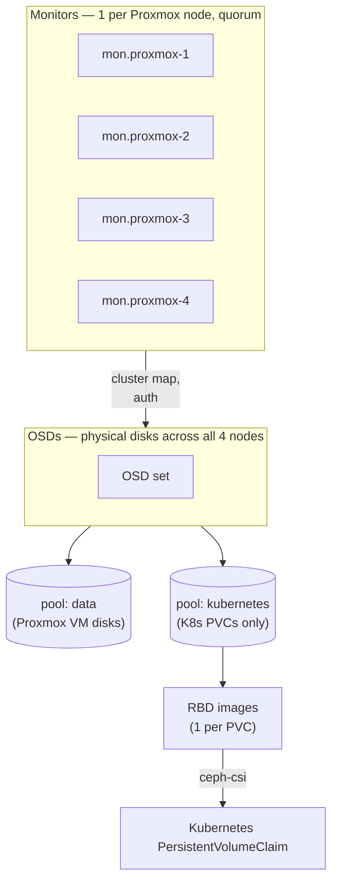

# Ceph Storage

How the 4 Proxmox nodes' shared Ceph cluster gets exposed to Kubernetes as a StorageClass — isolated from the pool Proxmox itself uses for VM disks.

## Why a separate pool, not the existing one

Proxmox already has a Ceph pool (`data`) holding every VM's disk — including Rancher's and the observability hub's. Kubernetes PVCs use a **second, dedicated pool** instead of sharing that one.

- **Blast radius.** The Ceph credentials handed to Kubernetes are scoped to the new pool only (`osd 'profile rbd pool=kubernetes'`) — even a fully compromised cluster can't touch VM disks, because the key literally has no permission to.
- **No pre-allocation needed.** Ceph pools don't reserve fixed capacity like a partition would; every pool draws from the same free-space pool cluster-wide unless a quota is set. Creating a second pool costs nothing until it's actually used.

## How the pieces map together



Two pools, same physical OSDs underneath, but a Kubernetes-scoped credential can only ever reach the `kubernetes` pool — the isolation is enforced by Ceph's own auth system, not by network segmentation alone.

## Creating the pool

```bash
ceph osd pool create kubernetes 32
ceph osd pool application enable kubernetes rbd
```
`32` is the initial placement-group count (matched to the existing `data` pool's PG count); Ceph's PG autoscaler adjusts it over time.

> ⚠️ **Deliberately not registered under Proxmox's `Datacenter → Storage`.** Registering it there would make it selectable as a VM-disk target in the UI, defeating the isolation this whole design is for. To inspect the pool from Proxmox, go to `<any-node> → Ceph → Pools` instead — that view shows every Ceph pool regardless of Storage registration.

**Cap it — pools have no size limit by default:**
```bash
ceph osd pool set-quota kubernetes max_bytes 500G
```
Without a quota, a runaway PVC (bug or oversized request) can consume the *entire* cluster's free space — including the space VM disks on the `data` pool depend on. 500 GiB is this lab's working ceiling, not a hard architectural number.

**Scope a Ceph user to just this pool:**
```bash
ceph auth get-or-create client.kubernetes \
  mon 'profile rbd' \
  osd 'profile rbd pool=kubernetes' \
  mgr 'profile rbd pool=kubernetes'
```
The `pool=kubernetes` scoping on the `osd` and `mgr` lines is the actual isolation boundary — remove it and this key can touch every pool in the cluster, including `data`.

> ⚠️ **Redacted for this repo:** `ceph auth get-or-create` prints a real authentication key (`key = AQ...==`) — that value is a live credential, not shown here. Generate your own; don't reuse a key you find published anywhere, including this repo's history if it's ever accidentally committed.

## Network config Ceph needs, on top of VLAN 109

[`03-networking-vlan-design.md`](03-networking-vlan-design.md) covers *why* storage traffic has its own VLAN and how it's wired. Getting Ceph's own daemons to actually use it correctly took a few hard-won rules — these are config-correctness principles, not one-off bugs, worth keeping as permanent constraints on how `ceph.conf` gets edited:

1. **`public_network` must list the storage VLAN only — never append the management subnet "just in case."** With multiple subnets listed, Ceph binds the OSD's front-facing address to whichever subnet is listed *first* — `public_network = <mgmt-subnet>,<storage-subnet>` silently binds to the management VLAN, and Kubernetes (which only has a route to the storage VLAN) can no longer reach it. One subnet, no ambiguity: `public_network = <storage-subnet>`.
2. **Monitor addresses (`ceph mon set-addrs`) get exactly one `v2` address per monitor, on the storage VLAN only.** A monmap with two `v2` addresses per monitor crashed the kernel RBD client (Linux 6.8) with `-22 EINVAL` in testing. Correct format: `[v2:<mon-ip>:3300/0,v1:<mon-ip>:6789/0]`.
3. **Update `mon_host` in `ceph.conf` immediately after `set-addrs`, not "eventually."** `set-addrs` makes a monitor stop listening on its old address right away (dynamic rebind). If `mon_host` still points at the old VLAN, every subsequent `ceph` CLI command hangs waiting for a monitor that's no longer there. Run both commands back to back.
4. **Wait for `pmxcfs` to sync before restarting any daemon.** After editing `/etc/pve/ceph.conf`, Proxmox's cluster filesystem takes roughly 10–45 seconds to propagate that change to every node. Restarting an OSD before that window closes means it reads the *old* config. Wait, then confirm with `ceph daemon osd.N config show` before trusting the change is live.
5. **Restart OSDs one node at a time, waiting for `HEALTH_OK` between each.** Restarting several OSDs simultaneously can drop the cluster below its replica minimum — and a VM whose disk I/O stalls because of that can cascade into much worse problems than a slow storage operation (a stalled etcd write-ahead-log has taken down a whole Kubernetes control plane in this lab before — see [`troubleshooting/`](troubleshooting)).

## Installing ceph-csi-rbd

Run from a node with `kubectl`/`KUBECONFIG` already pointed at the target cluster.

```bash
helm repo add ceph-csi https://ceph.github.io/csi-charts
helm repo update
```

`values.yaml`:
```yaml
csiConfig:
  - clusterID: "<your ceph fsid — `ceph fsid`>"
    monitors:
      - "<mon-1-ip>:3300"
      - "<mon-2-ip>:3300"
      - "<mon-3-ip>:3300"
      - "<mon-4-ip>:3300"        # one entry per monitor — all on the storage VLAN, see 03-networking-vlan-design.md

secret:
  create: false      # created separately (below) — deliberately not chart-managed

storageClass:
  create: false      # same reasoning

provisioner:
  replicaCount: 2                # match your actual worker count — see note below
  enableHostNetwork: true        # required: without it, the provisioner replies from a pod IP Ceph can't route to
  httpMetrics:
    containerPort: 8681           # avoid colliding with the nodeplugin's own 8080

cephconf: |
  [global]
    auth_cluster_required = cephx
    auth_service_required = cephx
    auth_client_required = cephx
    public_network = <storage-vlan-subnet>
```

> ⚠️ **`replicaCount` has to match how many nodes can actually schedule a normal pod, not how many nodes exist.** The chart's default (3 replicas) ships with a pod anti-affinity rule that refuses to run two provisioner replicas on the same node. A control-plane node's default taint excludes it from scheduling ordinary pods — so on a 1-CP-2-worker cluster, only 2 nodes are eligible, and a 3rd replica sits `Pending` forever. The fix is lowering `replicaCount` to match, **not** removing the control-plane taint just to make room — that taint is there on purpose, to keep the control plane free of workload noise.

```bash
helm install ceph-csi-rbd ceph-csi/ceph-csi-rbd \
  --namespace ceph-csi-rbd --create-namespace \
  -f values.yaml
```

**Verify pods are actually healthy, not just "deployed":**
```bash
kubectl -n ceph-csi-rbd get pods -o wide
```
`STATUS: deployed` from Helm only confirms the resources were created — it says nothing about whether the pods are running. Expect the `nodeplugin` DaemonSet pods to take a few minutes on first pull (the `cephcsi` image is ~760 MB); the `provisioner` pods should reach `Running` immediately once the replica count matches your real node count.

## Secret + StorageClass

**Secret** — namespace `ceph-csi-rbd`, type `Opaque`, two keys:

| Key | Value |
|---|---|
| `userID` | `kubernetes` |
| `userKey` | output of `ceph auth get-key client.kubernetes` |

> 💡 **Paste this key directly from the terminal output — don't retype it, and don't route it through an intermediate note or chat first.** Base64 is case-sensitive and a lowercase `l` next to an uppercase `I` is visually indistinguishable in a lot of fonts. A single flipped character makes the whole key silently invalid, and the failure it produces later looks exactly like a network or permissions problem — nothing about the error points back to a typo.

**StorageClass:**
```yaml
apiVersion: storage.k8s.io/v1
kind: StorageClass
metadata:
  name: csi-rbd-sc
provisioner: rbd.csi.ceph.com
parameters:
  clusterID: <ceph fsid>
  pool: kubernetes
  imageFeatures: layering            # required for the kernel RBD client — other features need a userspace client and fail to mount
  csi.storage.k8s.io/provisioner-secret-name: csi-rbd-secret
  csi.storage.k8s.io/provisioner-secret-namespace: ceph-csi-rbd
  csi.storage.k8s.io/controller-expand-secret-name: csi-rbd-secret
  csi.storage.k8s.io/controller-expand-secret-namespace: ceph-csi-rbd
  csi.storage.k8s.io/node-stage-secret-name: csi-rbd-secret
  csi.storage.k8s.io/node-stage-secret-namespace: ceph-csi-rbd
reclaimPolicy: Delete            # deleting the PVC deletes the backing RBD image — no orphaned images left behind
allowVolumeExpansion: true
mountOptions:
  - discard                      # TRIM support — reclaims freed blocks in Ceph when a pod deletes a file
```

## Verifying end-to-end

The only verification that actually proves the pipeline works: create a PVC, mount it in a pod, write data, delete and recreate the pod, confirm the data survived.

```bash
kubectl apply -f pvc-test.yaml
kubectl get pvc rbd-pvc          # STATUS should reach Bound
rbd ls kubernetes                # run on a Proxmox node — confirms the image actually exists in Ceph, not just in the Kubernetes API
```

A `Bound` PVC in `kubectl` and a real image listed in `rbd ls` are two different claims — checking only one of them is how a pipeline that looks fine in Kubernetes turns out to be silently disconnected from Ceph. Always check both.

---

Every bug encountered while building this pipeline — the provisioner replica math, a `KUBECONFIG` that resets every time a new root shell is opened, the netfilter conflicts that forced the VLAN 109 migration in the first place — is documented with its full debugging path in [`troubleshooting/`](troubleshooting).
