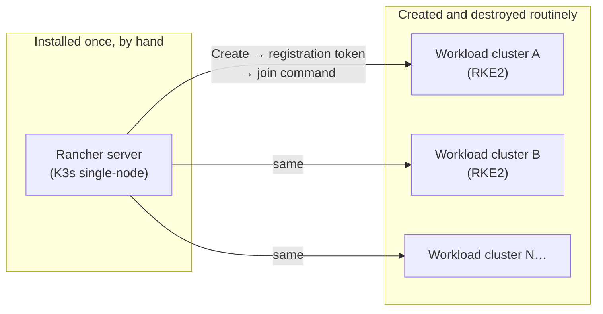

# Rancher + RKE2 Deployment

How Rancher gets installed once, and how it then provisions every Kubernetes cluster in this lab on demand.

> This page assumes a VM already exists, cloned from the template in [`02-proxmox-foundation.md`](02-proxmox-foundation.md) — it doesn't repeat those steps.

## Why Rancher instead of `kubeadm`

| | `kubeadm` | Rancher + RKE2 |
|---|---|---|
| Install | manual, per node | UI-driven, one workflow for N nodes |
| Ongoing management | `kubectl` only | web UI + `kubectl` |
| Cluster upgrades | manual | one click |
| Fits a lab that creates/destroys clusters often | poorly — every cluster is a fresh manual process | well — Rancher's whole job is managing *fleets* of clusters |

`kubeadm` is the right tool for learning what a control plane actually does. Rancher is the right tool once the goal shifts to "I need to create and tear down clusters routinely without re-deriving the steps each time" — which is this lab's actual operating mode (see [`01-architecture-overview.md`](01-architecture-overview.md)).

## The two roles this page covers



Rancher itself is a manual, one-time install (below). Every RKE2 cluster it then manages follows the same repeatable registration flow — and in this repo, that flow is what [`ansible/playbooks/07-join-cluster.yml`](../ansible/playbooks/07-join-cluster.yml) automates end to end.

> 💡 Rancher has no native Proxmox driver — it cannot create VMs itself. VM creation is a separate step (Ansible, or by hand per `02-proxmox-foundation.md`); Rancher only ever manages Kubernetes on VMs that already exist and are reachable.

## Installing Rancher

Rancher needs a Kubernetes cluster to run on before it can manage other ones. This lab uses K3s — a minimal single-node distribution — purely as Rancher's own host, not as a workload cluster.

```bash
# 1. K3s — hosts Rancher itself, pin a known-good version
curl -sfL https://get.k3s.io | INSTALL_K3S_VERSION="<version>" \
  sh -s - --write-kubeconfig-mode 644
export KUBECONFIG=/etc/rancher/k3s/k3s.yaml
echo 'export KUBECONFIG=/etc/rancher/k3s/k3s.yaml' >> ~/.bashrc

# 2. Helm
curl -fsSL https://raw.githubusercontent.com/helm/helm/main/scripts/get-helm-3 | bash

# 3. cert-manager — Rancher needs this for TLS
helm repo add jetstack https://charts.jetstack.io && helm repo update
helm install cert-manager jetstack/cert-manager \
  --namespace cert-manager --create-namespace --set crds.enabled=true

# 4. Rancher itself — sslip.io gives it a resolvable hostname with zero DNS setup
helm repo add rancher-stable https://releases.rancher.com/server-charts/stable
helm repo update
kubectl create namespace cattle-system

helm install rancher rancher-stable/rancher \
  --namespace cattle-system \
  --set hostname=rancher.<rancher-node-ip>.sslip.io \
  --set-string bootstrapPassword='<set-your-own>' \
  --set replicas=1

# 5. Rancher's own startup probe default (120s) isn't enough for first boot
kubectl -n cattle-system patch deployment rancher \
  --type=json \
  -p='[{"op": "replace", "path": "/spec/template/spec/containers/0/startupProbe/failureThreshold", "value": 60}]'

kubectl -n cattle-system rollout status deploy/rancher
```

> ⚠️ First boot can take 5–10 minutes (Rancher restores its git-based catalog repos on startup) — this is normal, not a hang. The `sslip.io` hostname trick means `rancher.<ip>.sslip.io` resolves to `<ip>` with no DNS record needed — genuinely useful for a lab, and safe to publish as a technique since it embeds whatever IP you give it, not a fixed secret.

## Reaching Rancher's UI from a network that can't route to the VM VLAN directly

A common lab situation: the operator's own machine sits on the management VLAN, which doesn't have a direct route to the VM-workload VLAN Rancher lives on. Four ways to bridge that gap, in order of how permanent they are:

| Approach | Best for | Requires |
|---|---|---|
| Static route via a Proxmox node acting as router | Whole team, permanent | IP forwarding enabled on that node |
| Reverse proxy (nginx) on a Proxmox node | Whole team, no routing changes needed | nginx installed on that node |
| Tailscale subnet router | Personal lab use | a Tailscale account |
| SSH tunnel | One-off, temporary access | nothing extra — just an SSH client |

This lab settled on a Tailscale subnet router (see [`01-architecture-overview.md`](01-architecture-overview.md) for where it's pinned) — it's the option that needed the least ongoing maintenance for a single-operator lab, at the cost of depending on a third-party relay service being reachable.

## Creating a downstream cluster

Once Rancher is up, every subsequent cluster follows the same flow — this is the part that gets fully automated later.

1. **Rancher UI → Cluster Management → Create → Custom → RKE2.** Name it, keep defaults, create.
2. Rancher generates a **registration token** and shows a `curl` command per node role (control-plane / worker) on the Registration tab.
3. **Run the control-plane node's join command first**, wait for it to register, *then* run the worker command(s). Joining out of order — or joining everything simultaneously — is exactly the race condition documented in [`troubleshooting/`](troubleshooting): the RKE2 planner needs to see the control-plane role register before it will accept workers, and joining them all at once can deadlock the planner entirely.

> 🚨 **The single most consequential ordering decision in this whole pipeline: certain cluster-networking manifests have to exist on the control-plane node *before* its `rke2-server` process starts for the first time — not applied as a fix afterward.** Getting this backwards is the root cause of a whole family of CNI/DNS bugs documented in [`troubleshooting/networking-and-cni.md`](troubleshooting/networking-and-cni.md). The short version: place the manifest, *then* run the join command — never join first and patch second.

```bash
mkdir -p /var/lib/rancher/rke2/server/manifests
# place the CNI/CoreDNS HelmChartConfig manifests here — see troubleshooting/networking-and-cni.md
# for exactly what they need to contain and why
```

## What's automated vs. what's still manual

| Step | Status |
|---|---|
| VM provisioning | Automated — [`ansible/playbooks/01-create-vms.yml`](../ansible/playbooks/01-create-vms.yml) |
| VM environment prep (disk, swap, conflicting packages) | Automated — see [`06-cluster-operations.md`](06-cluster-operations.md) |
| Cluster registration + join, in the correct order | Automated — [`ansible/playbooks/07-join-cluster.yml`](../ansible/playbooks/07-join-cluster.yml) |
| Rancher's own installation (this page, "Installing Rancher") | **Manual** — Rancher itself is a fixed, pinned service, not something recreated routinely |

The manual/automated split isn't arbitrary: things that get destroyed and recreated often (workload clusters) are worth the investment of automating; the thing that's installed exactly once and then left alone (Rancher itself) isn't.
