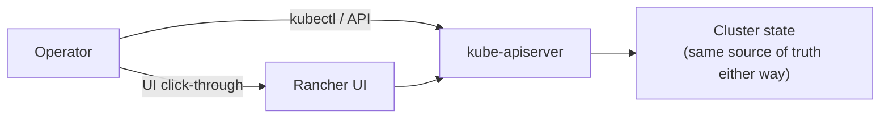

# Cluster Operations

Day-2 workflows for a cluster that already exists — deploying, scaling, debugging, exposing a service. Everything here has a Rancher-UI path and a `kubectl` path; both land on the same API, so pick whichever fits the moment (UI for quick inspection, `kubectl` for anything scriptable).



## Getting access

**Browser shell** — Rancher UI → cluster → the `>_` icon opens a `kubectl` shell running inside the cluster, no local setup needed. Good for a quick check from any machine.

**Local `kubectl`** — Rancher UI → cluster → **Download KubeConfig**, then point `$KUBECONFIG` (or `--kubeconfig`) at the downloaded file. Needed for anything scripted or repeated.

## Deploying something

Three equivalent paths, same result:

```bash
# Imperative — fastest for a one-off test
kubectl create deployment nginx-test --image=nginx --replicas=2
kubectl expose deployment nginx-test --port=80 --type=NodePort

# Declarative — the one worth scripting/versioning
kubectl apply -f deployment.yaml
```

Or Rancher UI → **Workloads → Deployments → Create**, filling in name/namespace/image/port.

**Service types, and when each makes sense:**

| Type | Use when |
|---|---|
| `ClusterIP` (default) | only other things inside the cluster need to reach it |
| `NodePort` | quick external access without setting anything else up — a random port in the 30000–32767 range opens on every node |
| `LoadBalancer` | need a stable external endpoint — requires a real cloud LB or something like MetalLB in a bare-metal lab |

## Namespaces

The isolation boundary for grouping workloads — by team, by environment, by anything that benefits from separate RBAC/quota/network-policy scope.

```bash
kubectl create namespace my-app
kubectl create deployment app --image=nginx -n my-app
```

## Scaling and rolling updates

```bash
kubectl scale deployment nginx-test --replicas=5

kubectl set image deployment/nginx-test nginx=nginx:1.25   # triggers a rolling update, zero downtime
kubectl rollout status deployment/nginx-test                # watch it happen
kubectl rollout undo deployment/nginx-test                  # roll back to the previous revision
```

Rancher UI equivalent: **Workloads → Deployments → (click one) → Edit**, change replica count or image tag directly.

## Logs and debugging

```bash
kubectl logs <pod> -n <namespace>              # last logs
kubectl logs <pod> -n <namespace> -f           # follow in real time
kubectl exec -it <pod> -n <namespace> -- bash  # shell into a running container
kubectl describe pod <pod> -n <namespace>      # Events section is usually where the real reason for a failure shows up
kubectl top nodes                              # resource usage — needs metrics-server
kubectl top pods -A
```

`kubectl describe` is worth reaching for before `kubectl logs` when a pod won't even start — a pod stuck in `Pending` or `ImagePullBackOff` often has an empty log (the container never ran), but its Events always say why.

Rancher UI equivalent: **Workloads → Pods → (click one) → View Logs** / **Execute Shell**.

## Ingress

Routes external traffic to a Service by hostname/path, instead of a raw NodePort:

```yaml
apiVersion: networking.k8s.io/v1
kind: Ingress
metadata:
  name: my-app
  namespace: my-app
spec:
  rules:
  - host: myapp.<node-ip>.sslip.io
    http:
      paths:
      - path: /
        pathType: Prefix
        backend:
          service:
            name: my-app-svc
            port:
              number: 80
```

> ⚠️ **Lab-only status: Ingress with a real internal hostname is currently blocked**, not implemented. It depends on an internal DNS record from this lab's network administrators that hasn't been provisioned yet. `sslip.io`-based hostnames (shown above) work as an interim substitute — they resolve `<name>.<ip>.sslip.io` straight to `<ip>` with no DNS setup required, which is enough for a lab but isn't a real hostname strategy.

## Installing packaged apps via Rancher's chart catalog

Rancher bundles a Helm chart repository browser — installing something like Prometheus or cert-manager through **Apps → Charts → (pick one) → Install** is equivalent to:

```bash
helm install <name> <chart> --namespace <ns> --create-namespace
```

worth knowing because it means anything installed through the UI can always be inspected/reproduced with plain `helm` afterward — the UI isn't hiding anything `helm` itself couldn't show.
