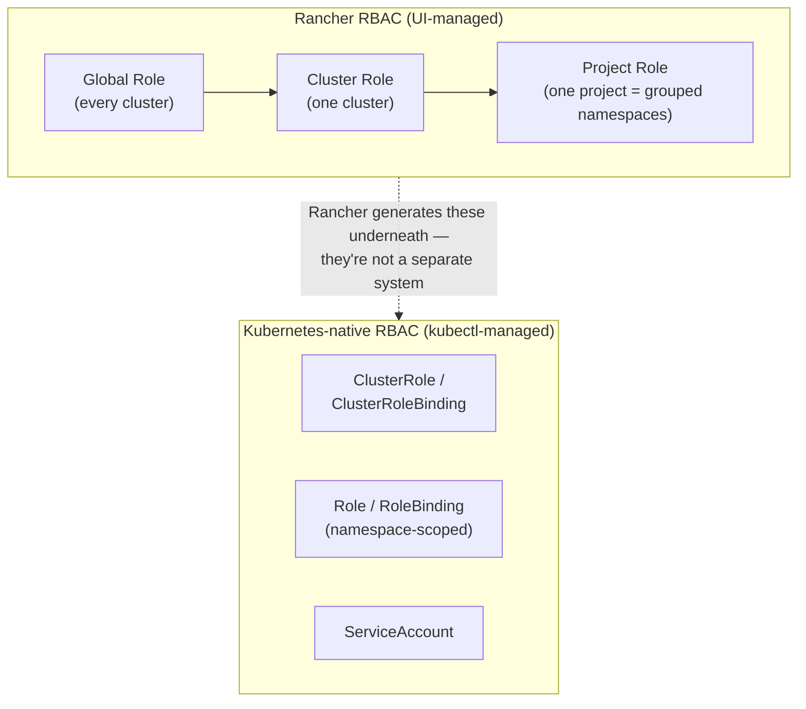

# RBAC & Security

How access is scoped in this lab — Rancher's own permission layer, and the Kubernetes-native RBAC it generates underneath.

## Why bother with RBAC in a single-operator lab

It would be easy to skip this entirely and just use the admin account for everything. Two reasons it's still worth building out properly here:

- **Anything automated (Ansible, CI) should run with exactly the permissions it needs, not the operator's full admin rights.** A compromised or buggy automation credential with cluster-admin scope is a much worse day than one scoped to a single namespace.
- **RBAC concepts here are the same ones tested in CKA/CKS** — practicing it against a real cluster with real consequences sticks better than a sandboxed exercise.

| Scenario | What breaks without RBAC |
|---|---|
| A new team member joins | Can delete production pods, read every Secret |
| Two teams share a cluster | Team A can see and modify Team B's namespace |
| A CI/CD pipeline runs | If its credential is cluster-admin, a compromised pipeline compromises everything |
| Auditing after an incident | No record of who did what, when |

## Two layers, one source of truth



Whatever gets configured through Rancher's UI is implemented as ordinary Kubernetes `Role`/`ClusterRole`/`RoleBinding` objects — `kubectl get clusterrolebinding` shows exactly what Rancher created. In an environment without Rancher (plain `kubeadm`, a managed cloud cluster), the same result requires writing those objects directly — which is also the part CKA actually examines.

**Rancher's three permission scopes:**

| Scope | Applies to | Example roles |
|---|---|---|
| Global Role | every cluster Rancher manages | Standard User (login only, no access until granted) |
| Cluster Role | one specific cluster | Cluster Member (read-only) vs. Cluster Owner (full admin, equivalent to `cluster-admin`) |
| Project Role | one Project (Rancher's own grouping of namespaces — not a native Kubernetes concept) | Read Only / Project Member / Project Owner |

## Granting a scoped user access

1. **Users & Authentication → Users → Create.** Assign the **Standard User** global role — this grants login only; the user sees an empty UI (no clusters visible) until access is explicitly granted below.
2. **Create a Project** to group the namespaces a team should work in — Rancher's Project is the unit both RBAC and resource quota attach to.
3. **Cluster → Members → Add**, grant **Cluster Member** (read-only at the cluster level: sees nodes and events, nothing more).
4. **Project → Members → Add**, grant **Project Member** (deploy/edit/delete *within that project's namespaces only*).

**Verifying isolation actually holds** — log in as the scoped user and confirm all three:
- The assigned cluster and project are visible; a namespace *outside* the project (e.g. a system namespace) is not.
- A workload deploys successfully inside the assigned namespace.
- Deleting something outside the assigned project is refused.

Then, from an admin session, confirm what Rancher generated under the hood:
```bash
kubectl get clusterrolebinding | grep <username>
kubectl get rolebinding -n <namespace>
kubectl describe rolebinding -n <namespace>
```

## Native Kubernetes RBAC — for identities that aren't people

A **ServiceAccount** is an identity for a pod or a pipeline, not a human — this is the pattern Ansible automation in this repo uses to talk to a cluster's API with a scoped credential instead of admin rights.

```bash
kubectl create serviceaccount ci-runner -n <namespace>
```

```yaml
# Role: exactly the verbs a CI pipeline needs, nothing more
apiVersion: rbac.authorization.k8s.io/v1
kind: Role
metadata:
  name: ci-deploy-role
  namespace: <namespace>
rules:
  - apiGroups: ["apps"]
    resources: ["deployments"]
    verbs: ["get", "list", "create", "update", "patch"]
  - apiGroups: [""]
    resources: ["pods", "services"]
    verbs: ["get", "list", "create", "delete"]
---
apiVersion: rbac.authorization.k8s.io/v1
kind: RoleBinding
metadata:
  name: ci-deploy-binding
  namespace: <namespace>
subjects:
  - kind: ServiceAccount
    name: ci-runner
    namespace: <namespace>
roleRef:
  kind: Role
  name: ci-deploy-role
  apiGroup: rbac.authorization.k8s.io
```

**Verify the grant without a real login** — `kubectl auth can-i` impersonates a ServiceAccount and answers yes/no, which is the fastest way to confirm least-privilege actually holds:
```bash
kubectl auth can-i create deployments \
  --as=system:serviceaccount:<namespace>:ci-runner -n <namespace>
# → yes

kubectl auth can-i delete namespaces \
  --as=system:serviceaccount:<namespace>:ci-runner
# → no — correctly has no cluster-level permission
```

## API tokens for automation

Ansible (or any external automation) needs a credential to call Rancher's API without a human logging in interactively.

1. **Account & API Keys → Create API Key.** Scope it **No Scope** unless it genuinely needs multi-cluster access; set an expiration rather than leaving it permanent where the workflow allows it.
2. The key is shown **once** — copy the Access Key and Secret Key immediately. The bearer token used in API calls is `<access-key>:<secret-key>`.
3. Store it in `ansible-vault` (or an equivalent secrets store) — never hardcoded into a playbook or committed to version control.

```bash
# Sanity check the token works at all:
curl -sk -u "<access-key>:<secret-key>" \
  https://<rancher-hostname>/v3/clusters \
  | python3 -m json.tool | grep -E '"name"|"state"'
# expect: your cluster listed with "state": "active"
```

This is the credential [`ansible/playbooks/07-join-cluster.yml`](../ansible/playbooks/07-join-cluster.yml) uses to call the Rancher API — creating clusters, pulling registration tokens, and fetching kubeconfigs programmatically instead of through the UI.
