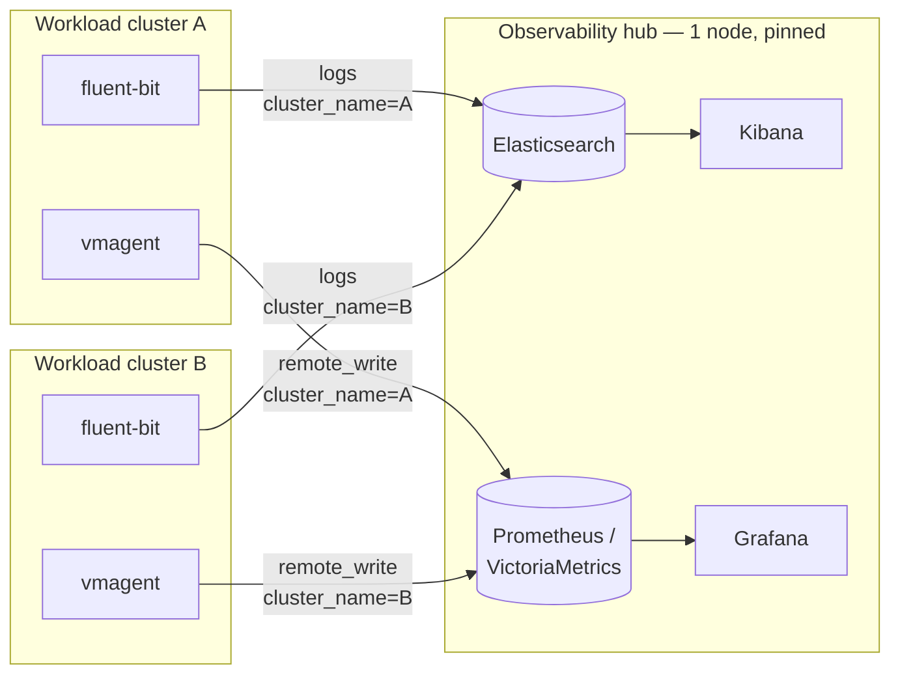

# Observability Hub

One centralized place for logs and metrics from every Kubernetes cluster this lab creates — instead of a full Prometheus+Grafana+Elasticsearch+Kibana stack duplicated on each one.

## Why centralize instead of per-cluster stacks

A full observability stack is expensive to run once, let alone N times. And workload clusters in this lab are disposable (see [`01-architecture-overview.md`](01-architecture-overview.md)) — if each one stored its own telemetry, destroying a cluster would destroy its own monitoring history along with it, right when that history might matter most (mid-incident, or right after something went wrong).

The alternative: every cluster runs only a **lightweight agent** — no local Prometheus, no local Elasticsearch — and ships everything to one hub that outlives all of them.



> ⚠️ **The `cluster_name` label is not optional.** Every agent tags its data with the name of the cluster it's running in before shipping it out. Without that tag, the hub has no way to tell apart cluster A's logs from cluster B's once they land in the same shared index — this bit a real debugging session before the tag was made mandatory everywhere.

## Standing up the hub

The hub is itself a Kubernetes cluster — single-node, joined to Rancher exactly like any workload cluster (see [`05-rancher-rke2-deployment.md`](05-rancher-rke2-deployment.md)), just never scaled beyond one node because a lab-scale observability workload doesn't need it.

| | |
|---|---|
| Role | etcd + control-plane + worker, all on one VM |
| Storage | Ceph CSI-RBD, same pattern as [`04-ceph-storage.md`](04-ceph-storage.md) — but its **own dedicated pool**, not shared with any workload cluster's pool |
| CSI provisioner replicas | **1**, not 2 — a single-node cluster has no second node to spread a second replica onto (see the anti-affinity note in the Ceph doc) |

```bash
# Same isolation pattern as every other Ceph consumer in this lab:
ceph osd pool create data-collector-hub-pvc 32
ceph osd pool application enable data-collector-hub-pvc rbd
ceph auth get-or-create client.data-collector-hub \
  mon 'profile rbd' \
  osd 'profile rbd pool=data-collector-hub-pvc' \
  mgr 'profile rbd pool=data-collector-hub-pvc'
```

## Metrics — Prometheus as a remote-write receiver

Rather than the hub scraping every cluster (which would need network access *into* each one), each cluster's `vmagent` **pushes** metrics out via `remote_write`. The hub only needs an inbound port open; it never needs a route back into a workload cluster.

```bash
helm upgrade --install observability-hub prometheus-community/kube-prometheus-stack \
  --namespace observability --create-namespace \
  --set prometheus.prometheusSpec.enableRemoteWriteReceiver=true \
  --set prometheus.service.type=NodePort \
  --set prometheus.service.nodePort=<port>
```

Verify the receiver is actually listening, not just that the pod is `Running`:
```bash
curl -s -o /dev/null -w "%{http_code}" http://<hub-ip>:<port>/-/ready       # expect 200
curl -s -o /dev/null -w "%{http_code}" http://<hub-ip>:<port>/api/v1/write # expect 405 (exists, rejects GET — POST-only endpoint)
```

## Logs — Elasticsearch + Kibana

```bash
helm install elasticsearch elastic/elasticsearch \
  --namespace observability \
  --set replicas=1 \
  --set volumeClaimTemplate.storageClassName=<storage-class> \
  --set volumeClaimTemplate.resources.requests.storage=<size>

helm install kibana elastic/kibana --namespace observability
```

> ⚠️ **Lab-only: single-node Elasticsearch reports `yellow`, permanently, and that's correct.** A 1-node cluster can never satisfy a replica-shard requirement (there's no second node to place a replica on) — `status: yellow` here means "every primary shard is healthy, no replicas exist," not "something is broken." Don't chase this to `green` on a single node; it's structurally impossible and chasing it wastes time on a non-problem.

Each workload cluster's `fluent-bit` ships logs here, index-per-cluster-per-day (`k8s-<cluster>-YYYY.MM.DD`), tagged with `cluster_name` via a `record_modifier` filter so Kibana can filter to one cluster's logs out of the shared stream.

## Securing the hub — two layers

| Layer | Protects against |
|---|---|
| Application-level auth (Elasticsearch `elastic` user, basic auth on the Prometheus write endpoint) | Anyone who can reach the port at all |
| Proxmox VE firewall, scoped to exactly the ports agents need, from the workload VLAN only | Anything on other VLANs, or outside the lab's network entirely |

> 🚨 **Enabling a Proxmox-level firewall has a real failure mode worth knowing before touching it: enabling it at the *datacenter* level (rather than per-VM) with a default-deny input policy cuts off the Proxmox hosts' own web UI and SSH, not just the VM you meant to restrict** — recovery then requires physical console access to every node. Scope firewall rules per-VM, and if a datacenter-wide policy is genuinely needed, flip the policy to allow *before* enabling the firewall toggle, never after.

## Known gaps — stated plainly, not fixed yet

This hub is a real, working piece of infrastructure, not a demo — which means it also has real, un-fixed limitations worth being upfront about rather than glossing over:

- **This node is a single point of failure for all observability, lab-wide.** It's pinned to the same physical node as Rancher itself (see [`01-architecture-overview.md`](01-architecture-overview.md)) — losing that node loses cluster management *and* every cluster's monitoring history at once. Accepted trade-off for a lab this size, not an oversight.
- **No index lifecycle management (ILM) on Elasticsearch yet.** Indices accumulate indefinitely; nothing currently ages out or deletes old data automatically.
- **The metrics remote-write endpoint currently has no authentication layer of its own** — it relies entirely on the Proxmox firewall boundary above. Application-level auth here is a known TODO, not yet implemented.

Every real incident this hub has actually been through — including a multi-day outage where it silently stopped accepting data while every health check still reported green — is documented in [`troubleshooting/observability-hub.md`](troubleshooting/observability-hub.md).
