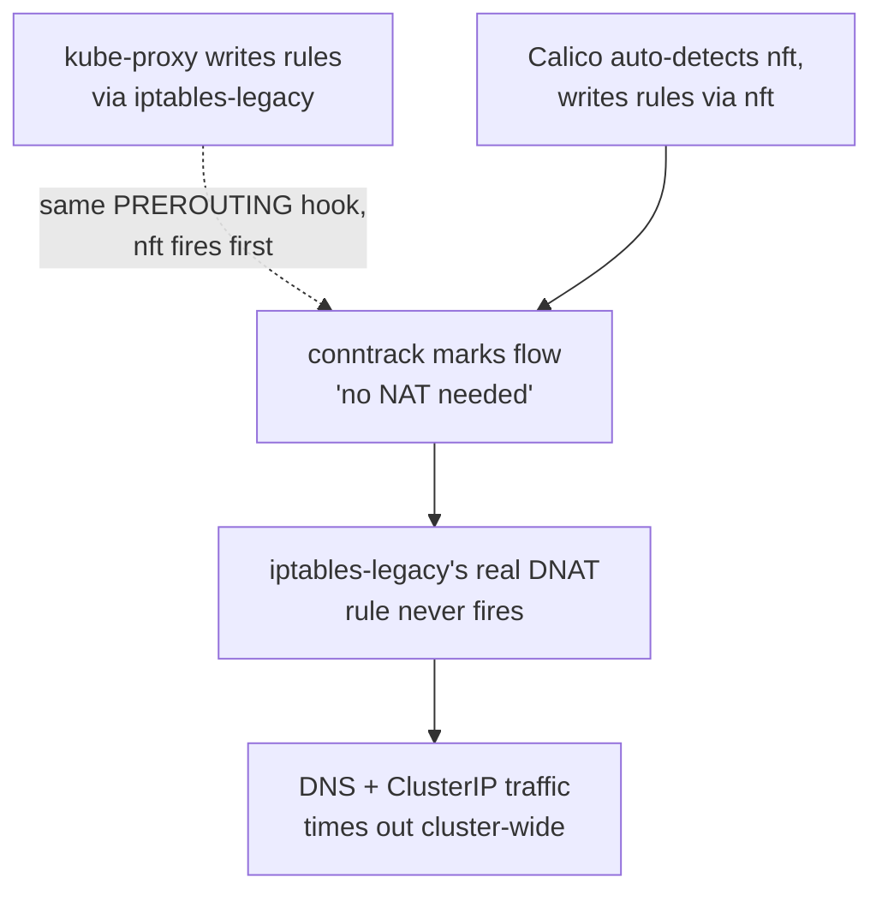

# Networking & CNI Bugs

Four real bugs, all traced back to two root causes, all hit while getting the very first RKE2 cluster in this lab off the ground. Kept together because they compound — fixing one exposed the next.

## The two root causes, up front

**Root cause A — two netfilter backends fighting over the same packet.** Ubuntu defaults to `iptables-nft`. RKE2's `kube-proxy` writes its rules through `iptables-legacy`. Calico's version at the time auto-detected the OS default and wrote *its* rules through `nft` — two independent rule sets, both claiming the same hook, and only one of them actually doing the NAT that made services reachable.

**Root cause B — a VM with more than one NIC confused Calico's address auto-detection.** Every node here has a workload NIC and a separate storage NIC (see [`03-networking-vlan-design.md`](../03-networking-vlan-design.md)). Calico's `firstFound` interface detection doesn't know which NIC is "the right one" — it just picks one — and it picked the storage NIC, advertising a VXLAN tunnel endpoint that nodes without a storage-VLAN route could never reach.



## Bug #1 — `cattle-cluster-agent` can't resolve its own Rancher hostname

**Symptom:**
```
cattle-cluster-agent CrashLoopBackOff
curl: (6) Could not resolve host: rancher.<ip>.sslip.io
```

**Root cause:** two problems stacked. First, the node's `/etc/resolv.conf` pointed at `127.0.0.53` (`systemd-resolved`'s loopback) — meaningless from inside a pod, where `127.0.0.53` is the *pod's own* loopback, not the node's. Second, the Rancher hostname trick (`rancher.<ip>.sslip.io`, which resolves to `<ip>` via a public DNS service — see [`05-rancher-rke2-deployment.md`](../05-rancher-rke2-deployment.md)) needs a real, working path to the internet to resolve at all, which an isolated lab VLAN doesn't reliably have.

**Fix — CoreDNS `hosts` plugin, applied via `HelmChartConfig`, present *before* the node ever joins:**
```yaml
apiVersion: helm.cattle.io/v1
kind: HelmChartConfig
metadata:
  name: rke2-coredns
  namespace: kube-system
spec:
  valuesContent: |-
    servers:
    - zones: [{zone: .}]
      port: 53
      plugins:
      - name: hosts
        configBlock: |-
          <rancher-ip> rancher.<rancher-ip>.sslip.io
          fallthrough
      - name: forward
        parameters: ". 8.8.8.8 8.8.4.4"
      # ...standard CoreDNS plugins omitted for brevity
    livenessProbe: { enabled: false }
    readinessProbe: { enabled: false }
```

> ⚠️ **Both probes must be disabled.** CoreDNS's `/health` and `/ready` endpoints returned `503` under this lab's configuration for reasons never fully root-caused — with probes enabled, that `503` triggers a restart loop and CoreDNS never stabilizes long enough to actually serve anything.

**Why a `HelmChartConfig`, not a direct ConfigMap edit:** RKE2 manages CoreDNS through its own Helm controller. A hand-edited ConfigMap gets silently reverted the next time Helm reconciles. `HelmChartConfig` is the supported extension point — it survives reconciliation and upgrades.

## Bug #2 — DNS and every ClusterIP timing out, cluster-wide

**Symptom:**
```
calico-kube-controllers CrashLoopBackOff: dial tcp <service-ip>:443: i/o timeout
Pods cannot reach CoreDNS's ClusterIP at all
```

**Root cause, traced with actual counters, not guessed:**
```bash
# DNAT rule exists but its hit-counter stays at zero despite real traffic:
iptables-legacy -t nat -L KUBE-SERVICES -n -v | grep <coredns-clusterip>
#   0     0  KUBE-SVC-xxx ...

# Confirms packets DO arrive at PREROUTING — the DNAT step is what's being skipped:
iptables-legacy -t nat -I PREROUTING 1 -p udp --dport 53 -j LOG --log-prefix "NATPRE: "
# dmesg shows the LOG hit
```
Both `nft` (Calico) and `iptables-legacy` (kube-proxy) register a rule at the same `PREROUTING` hook priority. Whichever runs first decides the packet's NAT fate for `conntrack` — and once `conntrack` has recorded "no NAT for this flow," the second backend's rule never gets a chance to run, even though it's the one with the actual DNAT target configured.

**Fix applied at the time:** force Calico onto the same backend kube-proxy already used.
```bash
nft delete table ip nat
kubectl patch felixconfiguration default --type=merge -p '{"spec":{"iptablesBackend":"Legacy"}}'
kubectl -n calico-system rollout restart daemonset calico-node
```

> 🔁 **This fix was later found to be unnecessary — and to cause a worse bug of its own.** On the OS/Calico version combination in this lab as of mid-2026, both backends default to `nft` consistently, and this whole conflict class doesn't occur at all if nothing is forced. Forcing `Legacy`, and then reverting that decision later, left orphaned `iptables-legacy` rules behind — because Felix, when it switches backends, cleans up its *new* backend's ruleset but not the *old* one. Those orphaned rules silently blocked pod-to-pod traffic for any pod created after the switch. That second-order bug — much harder to diagnose than this one, because it only affects newly-created pods, not the whole cluster — is documented in [`../ansible/TROUBLESHOOTING.md`](../ansible/TROUBLESHOOTING.md), along with the automated watchdog eventually built to catch a related deadlock at boot time. **The lesson that survived: don't force a netfilter backend override unless you've confirmed the conflict actually exists on your specific OS/CNI version combination — and if you do, plan for how to fully undo it later, not just how to apply it.**

## Bug #3 — Fixing Bug #2 didn't fully fix it

**Symptom:** after forcing Calico to `Legacy`, `calico-kube-controllers` was *still* `CrashLoopBackOff` with the same timeout — despite the `iptables-legacy` rules now being correct.

**Root cause:** switching backends made Calico write new rules into `iptables-legacy`, but it never cleaned up the *old* rules it had already written into `nft` while running in its previous mode. The `nft` filter table was still active and still evaluated first — and it had a dispatch chain listing every pod interface that existed *before* the switch, with a catch-all `DROP` for anything not explicitly listed. `calico-kube-controllers`' own network interface, created *after* the switch, fell straight into that catch-all and was silently dropped by a table nobody thought to check anymore.

```bash
# Flush the stale dispatch chains left behind by the switch:
nft flush chain ip filter cali-from-wl-dispatch
nft flush chain ip filter cali-to-wl-dispatch
kubectl -n calico-system delete pod -l k8s-app=calico-kube-controllers
```

This bug doesn't occur at all if Calico runs in one consistent mode from first boot — which is exactly why the *real* preventive fix isn't "flush stale chains," it's "never switch backends live on a running cluster" (see the callout in Bug #2).

## The actual takeaway

None of these three individually took long to fix once found. What made them expensive was **fixing them reactively, after a cluster was already half-broken**, each fix revealing the next problem underneath. The fix that stuck wasn't any one of the three `kubectl patch` commands above — it was moving the manifests that prevent Bug #1 into place *before* `rke2-server` ever starts for the first time, documented in [`../05-rancher-rke2-deployment.md`](../05-rancher-rke2-deployment.md)'s "Creating a downstream cluster" section. A cluster that never runs in the wrong mode never needs any of these fixes at all.
