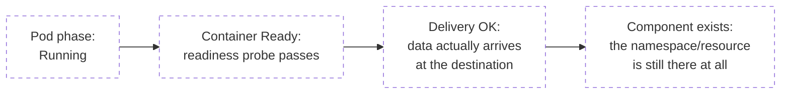
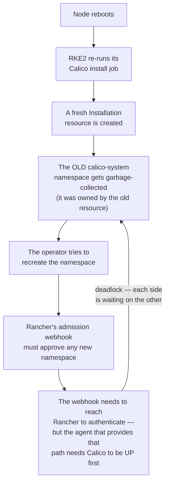

# Observability Hub Bugs

The hub (see [`08-observability-hub.md`](../08-observability-hub.md)) is the piece of this lab that produced the most instructive failures — partly because it's a single node with no redundancy, and partly because "is this actually healthy" turns out to be a much harder question than "is the pod Running."

## The pattern that shows up again and again here

Every bug on this page is a variant of the same shape: **a check that answers a narrower question than the one actually being asked, reporting healthy while something real is broken.**


Four different layers of "is this actually working," each one invisible to a check written for the layer before it. Every bug below sits at one of these seams.

## Bug — Elasticsearch reported `0/1 Ready` for 8 days before anyone noticed

**Symptom:** the hub's Elasticsearch pod sat at `0/1 Ready`. Nothing downstream visibly failed — logs kept arriving from workload clusters, because `fluent-bit`'s unlimited retry (`Retry_Limit False`) quietly queued everything and replayed it once the pod recovered. The gap was only discovered by chance, running an unrelated verification much later.

**Root cause — two separate, layered facts:**
1. The Helm chart's readiness probe script only demands `wait_for_status=green` **once**, tracked by a marker file inside the container's own writable filesystem. Every check after the first success only asks "does the process answer HTTP requests at all" — a much weaker question.
2. That marker file doesn't survive a container restart. After a restart (a crash, an OOM, a node reboot — anything), the probe reverts to demanding `green` again from scratch. But by then, a couple of small system indices had already been created with `replicas: 1` — impossible to satisfy on a single-node cluster, which structurally can never place a replica shard anywhere. The cluster was stuck `yellow` permanently, and the probe's *first-time* bar (`green`) could never be cleared again.

**Fix:**
```bash
# Immediate: the replica count these system indices actually need is 0 on a single node
curl -X PUT "<es-url>/<index>/_settings" -d '{"index.auto_expand_replicas":"0-1"}'

# Durable: apply the same setting as an index template so every FUTURE index — including
# ones created automatically by log shipping — inherits it, not just the ones fixed by hand
curl -X PUT "<es-url>/_index_template/<name>" -d '{
  "index_patterns": ["<pattern>"],
  "template": {"settings": {"index.auto_expand_replicas": "0-1"}}
}'
```

**The lesson:** `auto_expand_replicas: "0-1"` lets Elasticsearch size its own replica count to how many data nodes actually exist — 0 replicas on 1 node, expanding automatically if a second node ever joins — instead of a hardcoded number that's only ever correct for one specific topology. And more generally: **"pod phase: Running" and "application health: green" are answered by two completely different systems** — Kubernetes only knows the first one. Reading only the Kubernetes-level signal missed a real outage for over a week.

## Bug — a schema-validation change turned a silently-ignored config field into a hard crash

**Symptom:** a downstream cluster's CNI installation never started — `calico-system` stayed completely empty, and the install job sat in `CrashLoopBackOff` indefinitely.

**Root cause:** a config field this lab had been setting for months (`installation.calicoNetwork.iptablesBackend`) had **never actually been a valid field** in the CRD it was being set on. Older chart versions silently dropped unrecognized fields — no error, but also no effect, which is exactly why the mistake went unnoticed for so long. A newer chart version (pulled in automatically because the cluster wasn't pinned to an exact Kubernetes version) turned on strict schema validation, and the same field that used to be silently ignored now caused a hard install failure.

**The lesson, stated plainly:** *"this has always worked"* and *"this field is doing anything at all"* are different claims — a setting that's silently ignored looks identical, from the outside, to one that's working correctly. The only way to tell them apart is to read the actual source/schema, not to trust that a config block surviving several deployments means every line in it is meaningful.

## Bug #8 — a self-locking deadlock that only triggers at boot, discovered after 5 recurrences

This is the one that took the longest to actually understand, and the one this lab eventually built real automation around.

**Symptom, recurring:** every so often — after a reboot, after a neighboring VM starved this one of RAM, after any event that restarted the hub — Calico's entire `calico-system` namespace would be gone. Not degraded: **gone**, and unable to recreate itself. The cluster stayed broken until someone intervened by hand.

**Why it took 5 occurrences to actually find:** the first couple of incidents were each explained by whatever else was going wrong at the time (a firewall misconfiguration; a neighbor's resource contention) — plausible enough that nobody looked past those explanations to ask whether there was a *shared* mechanism underneath. It was the fifth recurrence, with no other explanation available, that forced a real root-cause investigation instead of accepting the nearest plausible story.

**The actual mechanism — a boot-time race that closes into a loop:**



Confirmed with Rancher's own webhook configuration: it deliberately exempts the `kube-system` namespace from this check (`failurePolicy: Ignore`), but nothing else — including `calico-system`, which is exactly the namespace an operator-managed CNI needs to recreate at runtime. **This isn't a misconfiguration on this lab's part — it's a structural gap in how Rancher's webhook rules interact with any CNI that manages its own namespace lifecycle.** Every reboot of a downstream cluster is, in effect, a coin flip: if the agent reconnects to Rancher before the operator tries to recreate the namespace, the cluster boots cleanly; if not, it deadlocks permanently until someone intervenes.

**What didn't work:** `failurePolicy: Ignore` on the webhook doesn't help here — that setting only changes behavior when the webhook is *unreachable*. In this deadlock, the webhook is perfectly reachable and healthy; it's *actively and correctly refusing* the request because the agent behind it isn't authenticated yet. Different failure mode, same symptom, no shared fix.

**The fix that finally stuck: a self-healing watchdog, not a one-time patch.** Because the root cause is a genuine race — not a static misconfiguration — no one-time `kubectl patch` closes it permanently; the next reboot rolls the dice again. What actually resolved it: a small `systemd` timer running on every cluster's control-plane node, checking every few minutes whether the CNI namespace and its DaemonSet are intact, and — only when they're actually missing — removing the stuck webhook long enough for the operator to recreate the namespace, then restoring it. The full implementation, plus a defect the watchdog's own first version had (it trusted a timeout instead of polling for the real condition, and escalated a repair that was already succeeding on its own) is documented in [`../ansible/TROUBLESHOOTING.md`](../ansible/TROUBLESHOOTING.md) — it's genuinely Ansible-automation content, not infrastructure-design content, which is why it lives there instead of here.

## Bug — logs stopped flowing for four days, and every health check said green

**Symptom:** the newest daily log index simply never grew. `fluent-bit` reported `Running`, its DaemonSet reported the expected pod count on every node, and the automated cluster-verify pipeline reported a full pass. Nothing was flagged as broken by anything watching it.

**Root cause, found by reading the shipping agent's own internal metrics rather than trusting Kubernetes' view of it:** the pod had started during an unrelated hub outage and gotten its TCP connection to Elasticsearch into a state it could never recover from on its own — every subsequent send attempt failed, retried, and failed again, forever, with `Retry_Limit False` ensuring it never gave up and never surfaced the failure as a crash either. A plain pod restart fixed the connection-level half of the problem immediately.

**But that wasn't the whole story.** After the restart, delivery mostly recovered — except for a specific subset of records that kept failing with the exact same generic warning as before, no more informative than the first time. Enabling the shipping agent's error-tracing option (off by default) revealed the real, second cause: **two different Kubernetes label conventions** coexisting in the same cluster (a plain `app: name` label on some pods, and the newer recommended `app.kubernetes.io/name` on others) produced records where the same destination field was sometimes a plain string and sometimes a nested object. Elasticsearch locks a field's type based on whichever shape it sees *first* each day — after that, every record with the *other* shape is rejected, permanently, until the index rolls over at midnight.

**Fix — the mapping issue needed an index template, not an agent change:**
```json
PUT _index_template/<name>
{
  "index_patterns": ["k8s-*"],
  "priority": 100,
  "template": {
    "mappings": {
      "properties": {
        "kubernetes": {
          "properties": {
            "labels": {"type": "flattened"},
            "annotations": {"type": "flattened"}
          }
        }
      }
    }
  }
}
```
`flattened` tells Elasticsearch to store the whole sub-object as one opaque field rather than trying to infer a schema for it — the correct type for "arbitrary key-value data whose shape isn't known in advance," which is exactly what Kubernetes labels are.

> ⚠️ **A trap worth naming explicitly: a second index template already existed for the same pattern, and composable index templates don't merge — only the single highest-`priority` match applies.** A first attempt at this fix created a brand-new template without checking for that, and it was silently overridden by the older one, with no error to indicate the new template had no effect at all. `PUT` returning `"acknowledged": true` only confirms Elasticsearch *saved* the template — it says nothing about whether that template actually governs any index.

**The two-layer lesson:** "pod Running" and "DaemonSet has the right pod count" both answer *"does the delivery mechanism exist and start correctly"* — neither one can answer *"is data actually arriving,"* which is a claim only the receiving side (or the shipping agent's own internal counters) can confirm. This is the fourth and final layer in the diagram at the top of this page — a component can exist, be healthy, and still not be doing its actual job.
